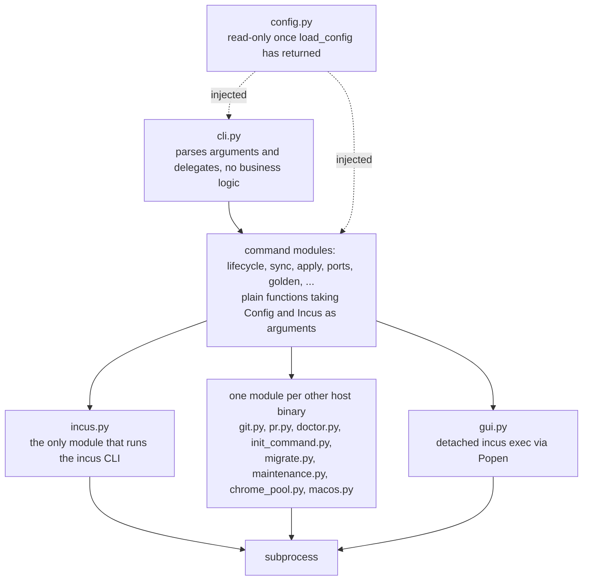

# Contributing to JailBee

Thanks for your interest in contributing to `jailbee`. This
document covers the dev setup, quality gates, and a few architecture rules
that keep the codebase consistent.

## Dev setup

`jailbee` is a Python 3.13 project (3.12+ supported), managed with
[`uv`](https://docs.astral.sh/uv/).

```bash
git clone https://github.com/VRTFinland/jailbee.git
cd jailbee
uv sync --all-extras --dev
```

Run the CLI from source without installing:

```bash
uv run jailbee --help
```

You do **not** need a real Incus daemon, an Incus host, or network access to
develop or test `jailbee` — see "Test isolation" below.

## Quality gates

Before opening a PR, make sure all of these pass:

```bash
uv run pytest                  # test suite
uv run mypy src/                # strict type checking
uv run ruff check src/ tests/           # lint
uv run ruff format --check src/ tests/  # formatting
```

CI (`.github/workflows/ci.yml`) runs the same four commands on Python 3.12
and 3.13 for every push to `main` and every pull request.

> **Run ruff last, and commit its fixes separately.** If `ruff check --fix`
> or `ruff format` changes anything, commit that as its own `style:` (or
> `chore:`) commit, distinct from the behavioural change. This keeps diffs
> reviewable and bisect-friendly — a reviewer (or `git bisect`) shouldn't
> have to wade through mechanical reformatting to find the logic change.

## Test isolation

**All tests are fully mocked — no real Incus daemon, no real containers, no
network.** `subprocess.run` is mocked via `pytest-mock`; filesystem
operations use `tmp_path`. If you find yourself wanting to run a real
`incus` command from a test, that test belongs in a future integration
suite, not the unit suite under `tests/`.

Every module in `src/jailbee/` has a matching `tests/test_*.py`. If
you change behavior, update the corresponding test file in the same PR.

## Architecture rules

A few rules keep the codebase testable and easy to reason about — please
follow them in any change:

- **`src/jailbee/incus.py` is the only module that calls
  `subprocess` for `incus` CLI operations.** Every other module calls
  `Incus` wrapper methods instead, so it can be unit-tested with a mocked
  wrapper rather than a mocked subprocess call. (`gui.py` is the deliberate
  exception: it spawns a *detached* `incus exec` via `subprocess.Popen` so a
  GUI app outlives the CLI process.) Shelling out to *other* host binaries
  is fine and stays in one module per concern: `git.py` (`git`), `pr.py`
  (`git`, `gh`), `doctor.py` (`docker`, `systemctl`),
  `init_command.py`/`migrate.py` (`systemctl`), `maintenance.py` (`du`),
  `chrome_pool.py` (`rsync`), `macos.py` (`sh`).
- **`config.py` is read-only after load.** No module mutates the loaded
  `Config` object once `load_config()` has returned it.
- **`cli.py` stays thin.** It only parses arguments and delegates; business
  logic lives in plain functions that accept `Config` and `Incus` as
  explicit inputs.
- **No global state.** Command functions take their dependencies as
  parameters rather than reaching for module-level singletons.

The same rules as a picture — every arrow that reaches a real process goes
through exactly one module:



See [`CLAUDE.md`](CLAUDE.md) for the fuller set of conventions (import
style, config fixtures, manual smoke-test recipes, etc.) used when working
on this repo with an AI coding agent — most of it applies to human
contributors too.

## Commit conventions

Use [Conventional Commits](https://www.conventionalcommits.org/) prefixes:

- `feat:` — a new feature
- `fix:` — a bug fix
- `test:` — test-only changes
- `docs:` — documentation only
- `chore:` — tooling, CI, dependency bumps, and similar
- `refactor:` — code change that neither fixes a bug nor adds a feature
- `style:` — formatting-only changes (see the ruff note above)

Scope is optional but encouraged, e.g. `feat(lifecycle): add --background
flag to jailbee new`.

## Submitting a change

1. Fork the repo and create a branch for your change.
2. Make your change, keeping commits small and logically scoped.
3. Update or add tests under `tests/` alongside any behavioural change.
4. Run the quality gates above; fix everything they report.
5. Open a pull request describing the change and linking any relevant
   issue. The PR template will prompt you for the essentials.

## Releasing (maintainers)

Releases are cut locally from `main` with `make release VERSION=x.y.z`, which
builds, publishes to PyPI, and creates a GitHub Release in one interactive
step. See [`docs/releasing.md`](docs/releasing.md) for prerequisites (PyPI
token, `gh` auth), the TestPyPI dry run, and the full flow.

The CHANGELOG step of that flow (`docs/releasing.md`) is also where you check
`UPGRADE_NOTES` in `src/jailbee/upgrade.py` for a needed entry — see that
document for the procedure.

## Reporting bugs and proposing features

Please use the issue templates (`.github/ISSUE_TEMPLATE/`) — they ask for
the details (repro steps, `jailbee doctor` output, Incus version) that make
triage fast.

Security issues should **not** go through public issues — see
[`SECURITY.md`](SECURITY.md) for the private disclosure process.
