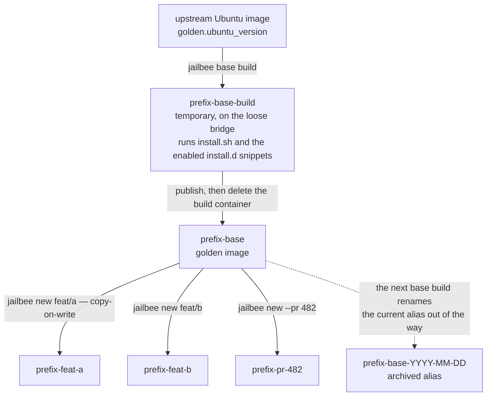
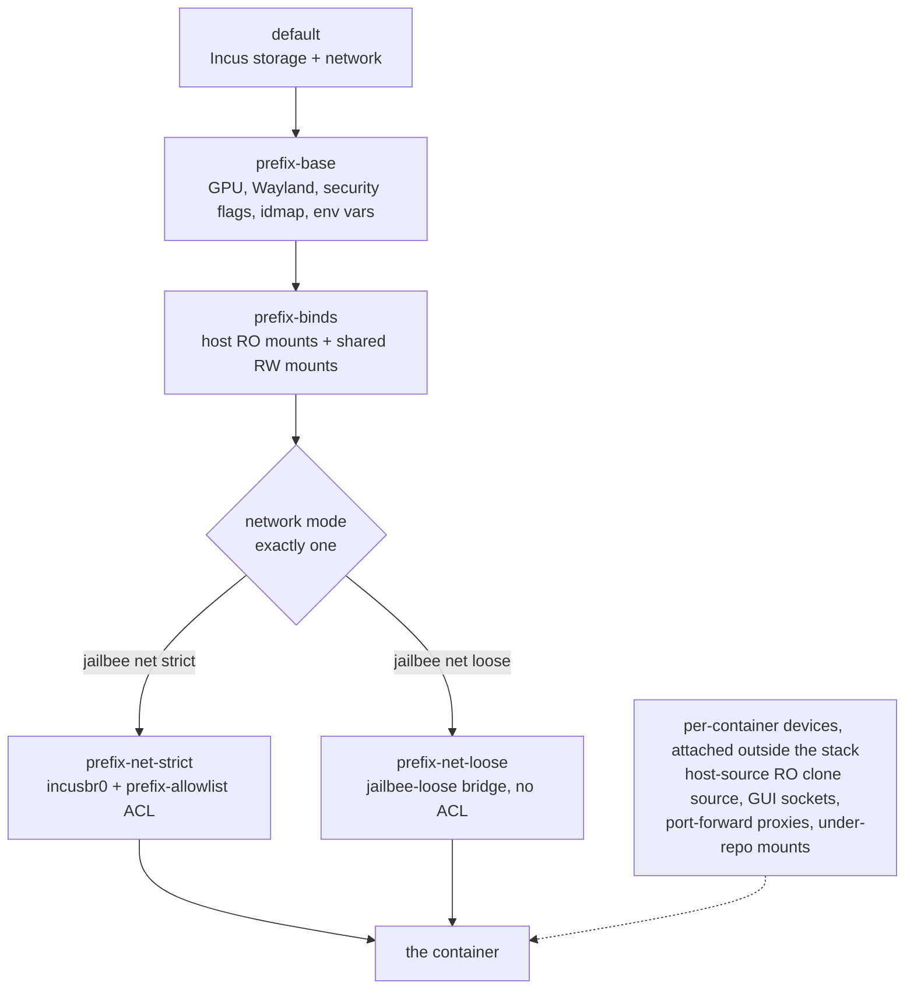
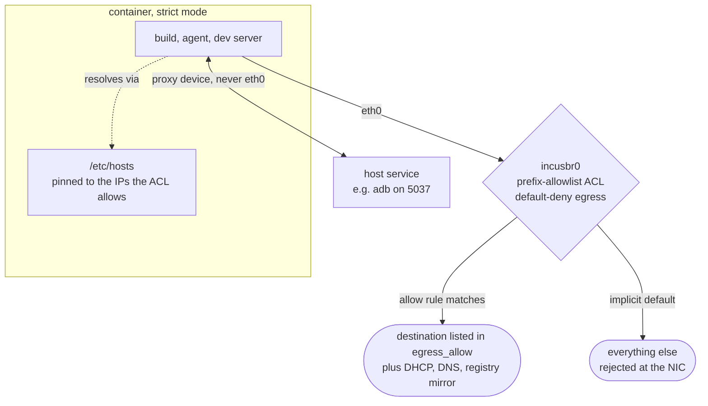

# Architecture

`jailbee` wraps [Incus](https://linuxcontainers.org/incus/) system containers to
give each git branch its own isolated, full-stack development environment.
This is a short overview of how the pieces fit together; see the code under
`src/jailbee/` for the authoritative behaviour.

## Golden image

`jailbee base build` provisions one Incus image (alias `<container_prefix>-base`)
via `provision/install.sh` plus the `install.d/*.sh` snippets. The image is
stack-neutral by default (locale, prompt, GUI libs, GitHub CLI, tmux,
build-essential); language runtimes and cloud helpers — Node, Java, Docker,
Python, the ECR helper — are bundled but opt-in, staged only when named in
`golden.enable_snippets` (see [`config.md`](config.md)). Every
`jailbee new` clones a fresh container from that image **copy-on-write**, so
container creation is fast and each container's disk only diverges from the
golden base by what changes at runtime. Rebuilding the golden image (`jailbee
base build`) does not touch existing containers — they keep running on
whatever base they were cloned from until destroyed.

Here and below, `prefix` stands for the repo's `container_prefix`.

## Layered profiles

Incus profiles are composable and independently swappable. Each container is
built from a stack of profiles:

Splitting GUI/security config from bind mounts from network policy means a
container's network mode can change (`jailbee net strict|loose`) without
touching anything else, and profile edits from `.jailbee/config.yaml` changes
apply via `jailbee apply` without rebuilding the container.

## Shared state

`<shared_dir>` (default `~/.local/share/jailbee/shared/<container_prefix>`) is
bind-mounted read-write into every container for the repo. It holds package
manager caches (pnpm, Gradle, npm, m2), the JetBrains config/data directories,
the Chrome profile pool, and the Claude Code install + config — state that
should persist across `jailbee new`/`jailbee destroy` cycles and be shared between a
repo's containers, but never leak into the host's own dotfiles. A separate
host-global Docker registry mirror container (`jailbee-registry-mirror`) caches
image pulls across all repos.

## Read-only host binds

Secrets and host-installed tools are bind-mounted read-only rather than
reinstalled per container: GnuPG keys and SSH agent socket, JetBrains
Toolbox/IDE binaries, the Chrome binary, and the host's `xterm-kitty`
terminfo entry (so a kitty-terminal `jailbee shell` doesn't warn about a
non-functional terminal). Read-only mounts mean a compromised or
experimental process inside a container cannot modify the host source of
those files.

## Egress allowlist and `/etc/hosts` pinning

`strict` network mode (the default) attaches an Incus network ACL
(`<prefix>-allowlist`) that default-denies egress except destinations listed
in `egress_allow` (plus feature-driven auto-adds for JetBrains/Claude/GitHub
when those integrations are enabled). Hostnames are resolved to IPv4 at
`jailbee init`/`jailbee apply` time; **all** returned A-records are added, which
matters for CDN-fronted services that round-robin a small IP pool. Those same
resolved IPs are pinned into each strict-mode container's `/etc/hosts`, so the
container's own DNS resolution can't drift from what the ACL was built
against. `jailbee apply --no-restart` re-resolves and refreshes both live,
without a container restart. `loose` mode (a dedicated bridge with no ACL)
is the other selectable state.

Port forwards sit outside this mechanism by construction. A forward
(`host_ports` in config, or an ad hoc `jailbee port`) is one Incus `proxy`
device, and Incus's forkproxy connects directly into or out of the container's
network namespace instead of sending packets over the NIC — so the traffic
never traverses the bridge the ACL is attached to, and neither direction is
filtered by it. `jailbee net status` lists the active forwards next to the
strict-mode summary for that reason; see
[Security and limitations](security.md#port-forwards).

The two paths out of a strict-mode container, and why only one of them meets
the ACL:

## Host <-> container git bridge

Containers clone the source repo with `git clone --shared`, so a container's
`.git/objects/info/alternates` points at the host repo's object store —
transporting a feature branch's worth of commits is tens of kilobytes,
independent of overall repo size. `jailbee git fetch/checkout/pull` pull a
container's commits back to the host over an `ext::incus exec ... git
upload-pack` transport, landing them under `refs/jailbee/<container>/<branch>`
without ever touching GitHub. `jailbee git push` is the inverse: it transports a
host branch into the container under `refs/jailbee/host/<branch>`, fast-forwards
the container's own `refs/heads/<branch>` to match where it safely can, and can
then merge or rebase the pushed ref inside the container. `jailbee pr` fetches a container's
branch to the host and opens or updates a GitHub PR from it via `gh`. None of
this requires network egress from the container beyond what the operator
explicitly allows.

## Security model

The isolation rationale — why a `jailbee` container with a disabled in-process
sandbox is a reasonable place to run agentic tools — lives in
[Security and limitations](security.md).
